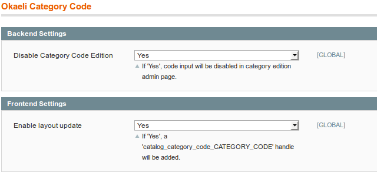

# Okaeli_CategoryCode

----------------------

```
@category   Okaeli  
@package    Okaeli_CategoryCode  
@author     Julien Loizelet <julienloizelet@okaeli.com>  
@copyright  Copyright (c)  2017 Julien Loizelet  
@license    GNU GENERAL PUBLIC LICENSE Version 3
  
```

## Description

`Okaeli_CategoryCode` is a Magento extension that will add a "code" attribute to categories.
The main purpose of this is to have a better unique identifier to manage categories (better than Id that could be dependent of the environment)

## Installation

This extension can be installed with `modman` or `composer`.

### Requirements

- Magento >= 1.6 (probably much earlier, but I didn't test)

### Modman

Run `modman link /path/to/your/clone/of/this/repo` at root of your Magento Project.

### Composer

In your `composer.json` file, add
```
 {
"type": "vcs",
"url": "https://github.com/julienloizelet/magento1-categorycode"
 }
```
in the `repositories` part and
```
"okaeli/magento1-categorycode":"dev-master"
```
in the `require` part.


## Usage

### Features

0. If you have to update datas of a category in a data upgrade script for example, you should use :
`Mage::getModel('catalog/category')->loadByAttribute('okaeli_category_code','here-the-code-of-the-category');`
0. If you need to update layout of a category and do not want to do it in the database, you should use the handle
`catalog_category_code_HERE-THE-CODE-OF-THE-CATEGORY`
0. You will find a shell script `okaeli_category_code_generate.php` that can generate `okaeli_category_code` attribute
for each category.

### Configurations

This module comes with some configurations :

  * `System Config > Okaeli > Okaeli Category Code`

  **_Backend_**

  * Disable / Enable admin category code edition.
  _(As the code should be used for design in layout, modifying it can break your design. So, it is strongly suggested to disable admin edition.)_


  **_Frontend_**

  * Enable / Disable frontend layout update.

  

## Technical Notes

### No rewrite. Events driven development.

This extension is **0 rewrite**  guaranteed. The following events are listened:

  * `controller_action_layout_load_before` : used to add custom handle.
  * `adminhtml_catalog_category_edit_prepare_form` : used to disable `okaeli_category_code` edition in admin.


### Coding Standards

This extension has been checked with the [Magento Extension Quality Program Coding Standard](https://github.com/magento/marketplace-eqp).
You can find the output of the command `phpcs /path/to/Okaeli/CategoryCode/sources --standard=MEQP1` in [this file](doc/coding-standard/magento-eqp.txt).

## Support

If you encounter any problems or bugs, please create an issue on
[GitHub](https://github.com/julienloizelet/magento1-categorycode/issues).

## Contribution

Any contribution is highly welcome. The best possibility to provide any code is to open
a [pull request on GitHub](https://help.github.com/articles/using-pull-requests).

## License

[GNU General Public License, version 3 (GPLv3)](http://opensource.org/licenses/gpl-3.0)